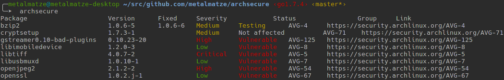

# archsecure

Check your machine for issues posted on Arch Linux's [security issue tracker](https://security.archlinux.org/). This will simply fetch and parse the table hosted on the website, retrieve all your locally installed packages and match packages and versions.

If matches are found they will be printed like this:

```
Package                     Version      Fixed     Severity   Status         Group     Link
bzip2                       1.0.6-5      1.0.6-6   Medium     Testing        AVG-4     https://security.archlinux.org/AVG-4
cryptsetup                  1.7.3-1                Medium     Not affected   AVG-71    https://security.archlinux.org/AVG-71
gstreamer0.10-bad-plugins   0.10.23-20             High       Vulnerable     AVG-125   https://security.archlinux.org/AVG-125
libimobiledevice            1.2.0-3                Low        Vulnerable     AVG-8     https://security.archlinux.org/AVG-8
libtiff                     4.0.7-2                Critical   Vulnerable     AVG-5     https://security.archlinux.org/AVG-5
libusbmuxd                  1.0.10-1               Low        Vulnerable     AVG-7     https://security.archlinux.org/AVG-7
openjpeg2                   2.1.2-2                High       Vulnerable     AVG-54    https://security.archlinux.org/AVG-54
openssl                     1.0.2.j-1              Low        Vulnerable     AVG-67    https://security.archlinux.org/AVG-67
```

or in terminals with color:




## Installation

### From AUR

I've made the program available on AUR: https://aur.archlinux.org/packages/archsecure-git/  
If you have e.g. [pacaur](https://aur.archlinux.org/packages/pacaur/) installed you can simply run:

```
$ pacaur -S archsecure
```

### From Source

You need to have a working [Go](https://golang.org/) installation on [Arch Linux](https://www.archlinux.org/) for this script to work. To install Go, run

```
$ sudo pacman -S go
```

Set up your `$GOPATH` and also don't forget to add `export PATH=$PATH:$GOPATH/bin` to your file of choice that will be sourced during terminal startup. This will allow to call the binary globally. For further information, please check the [wiki](https://wiki.archlinux.org/index.php/Go).

To retrieve `archsecure`, simply run:

```
$ go get github.com/metalmatze/archsecure
```


## Run 

```
$ archsecure
```


## Contributing

Fork → Patch → Push → Pull Request


## License

This project is under the GPLv3 License. See [LICENSE](LICENSE) file for full license text.
